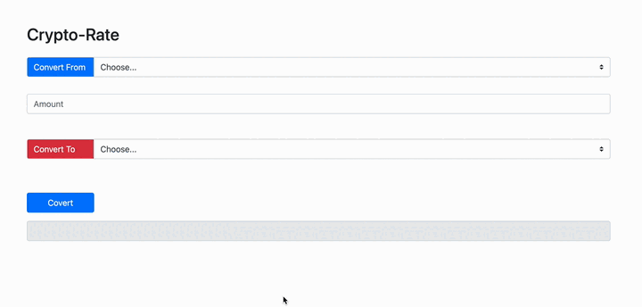

# Currency converter

In this assignment, you'll be creating a currency converter that leverages the Coinbase API to convert between different cryptocurrencies and fiat currencies.

## Task:
Your task is to develop a JavaScript application that will use user input to convert a given amount of a selected cryptocurrency into another selected currency (e.g., USD, EUR).

## Requirements:

- Your application should make use of the interface provided in `index.html`. It includes a selection dropdown for cryptocurrencies, an input field for the amount, and a **Convert** button to trigger the conversion.
- Don't modify the `index.html` file. All your code should be written in the `solution.js` file.
- Implement your logic in such a way that when a user presses the **Convert** button, your application fetches the conversion rate from the Coinbase API and displays the conversion result to the user.
- Utilize the [Coinbase API](https://docs.cloud.coinbase.com/sign-in-with-coinbase/docs/api-prices#get-spot-price) to fetch the spot price for the chosen cryptocurrency against the selected currency. 

## Instructions:

- Make a GET request to the following Coinbase API endpoint to retrieve the spot price: `https://api.coinbase.com/v2/prices/{crypto}-{currency}/spot`. Replace `{crypto}` with the selected cryptocurrency and `{currency}` with the selected currency.
- Remember to handle any potential errors, such as network issues or invalid user inputs.

Expected Output:

## Points to Consider:

- Familiarize yourself with the Coinbase API documentation to understand how to fetch spot prices.
- Be aware of the API usage limitations. Making too many requests in a short time frame may temporarily block your access to the API.

## Good luck!

[//]: # (autograding info start)
#  Results
> ⌛ Give it a minute. As long as you see the orange dot  on top, CodeBuddy is still processing. Refresh this page to see it's current status.
>
> This is what CodeBuddy found when running your code. It is to show you what you have achieved and to give you hints on how to complete the exercise.

### API Fetch

|                 Status                  | Check                                                                                    |
| :-------------------------------------: | :--------------------------------------------------------------------------------------- |
|  | API is called with correct URL params |

### Conversion

|                 Status                  | Check                                                                                    |
| :-------------------------------------: | :--------------------------------------------------------------------------------------- |
|  | App performs currency conversion and displays correct result to user |

[🔬 Results Details](../../actions)
[🐞 Tips on Debugging](https://github.com/DCI-EdTech/autograding-setup/wiki/How-to-work-with-CodeBuddy)
[📢 Report Problem](https://docs.google.com/forms/d/e/1FAIpQLSfS8wPh6bCMTLF2wmjiE5_UhPiOEnubEwwPLN_M8zTCjx5qbg/viewform?usp=pp_url&entry.652569746=Browser-Crypto-CurrencyConverter)

[//]: # (autograding info end)